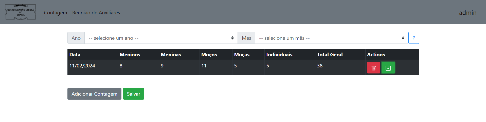

# ccb-recitativos

### Objetivo
Sistema implementado para o controle das contagens de recitativos das reuniões de jovens e menores da comum congregação
do Jardim Santa Mônica - Campinas-SP

Com o sistema, o usuário será capaz de cadastrar novas contagens, 
bem como editar e deletar contagens passadas.

### Tecnologias Utilizadas

 - Spring Boot (JAVA)
 - PostgreSQL
 - Docker

### Prévia

### O que falta ser implementado

- Acesso por roles (Leitura, escrita, admin, etc...)
- Registrar quem atendeu o culto
- Deletar contagens
- Tela de perfil

### Bugs conhecidos

- [#3 - Edit não funciona](https://github.com/Lnvictor/ccb-recitativos/issues/3)