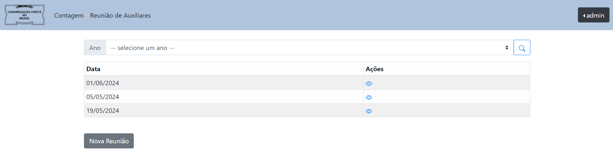
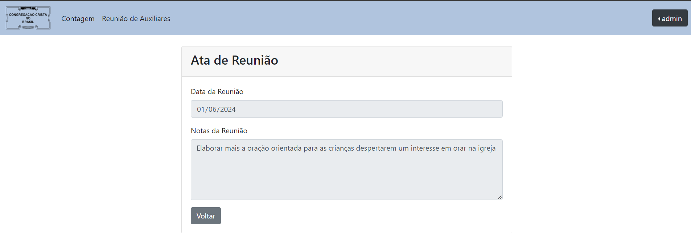

# Sistema Recitar

### Objetivo
Sistema implementado para o gerenciamento dos recitativos das reuniões de jovens e menores da comum congregação
do Jardim Santa Mônica - Campinas-SP

Com o sistema, o usuário será capaz de gerenciar as contagens de recitativos e armazenar as informações importantes 
discutidas nas reuniões de auxliares

Voce pode acessar pelo seguinte link: [https://ccb-recitativos.onrender.com/login](https://ccb-recitativos.onrender.com/login)

### Tecnologias Utilizadas

 - Spring Boot (JAVA)
 - PostgreSQL
 - Docker

### Prévia

### Controle dos recitativos

### Controle das reuniões de auxiliares

### O que falta ser implementado

- Registrar quem atendeu o culto
- Tela de perfil
- Implementar validação para add contagens somente aos domingos(visto que as reuniões ocorrem neste dia)
- Auxiliares poderem registrar as partes de palavra dos proximos domingos
