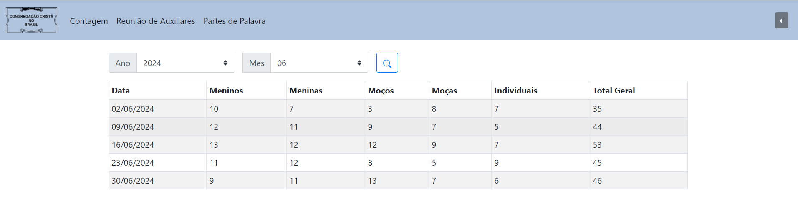
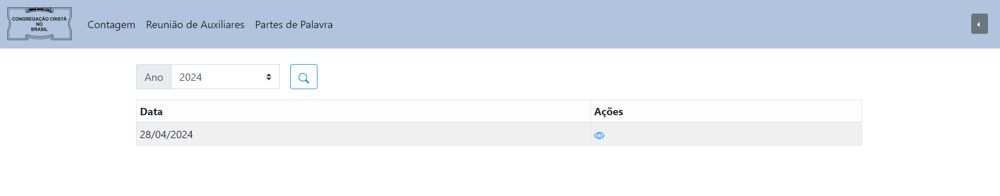

<h1 style="text-align: center"> Sistema Recitar</h1>
  

    

## Objetivo
Sistema implementado para o gerenciamento dos recitativos das reuniões de jovens e menores da comum congregação
do Jardim Santa Mônica - Campinas-SP

Com o sistema, o usuário será capaz de gerenciar as contagens de recitativos e armazenar as informações importantes 
discutidas nas reuniões de auxliares

Voce pode acessar pelo seguinte link: [http://ec2-100-29-188-80.compute-1.amazonaws.com:8080/](http://ec2-100-29-188-80.compute-1.amazonaws.com:8080/)

### Tecnologias Utilizadas

 - Spring Boot (JAVA)
 - PostgreSQL
 - Docker

### Prévia

### Controle dos recitativos

### Controle das reuniões de auxiliares

### Controle das partes de Palavras

